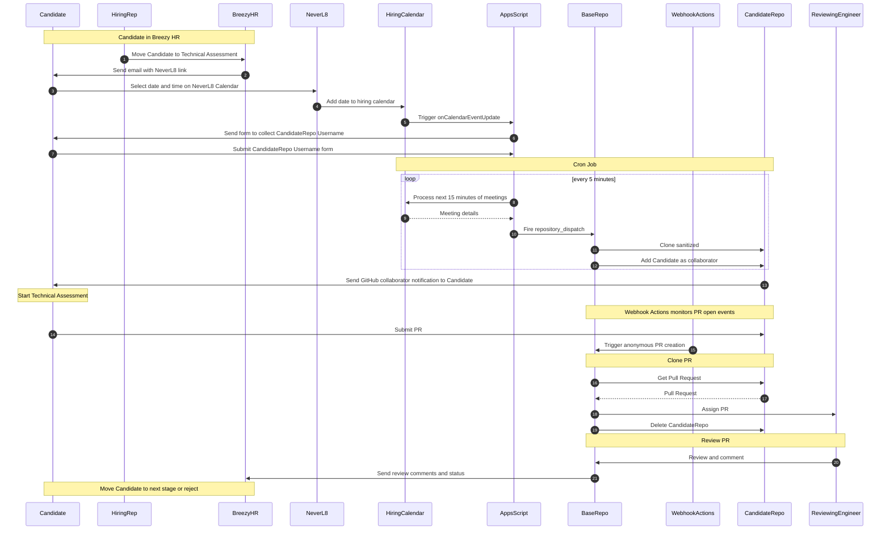

```mermaid
sequenceDiagram
    autonumber
    participant Candidate
    participant HiringRep
    participant BreezyHR
    participant NeverL8
    participant HiringCalendar
    participant AppsScript
    participant BaseRepo
    participant WebhookActions
    participant CandidateRepo
    participant ReviewingEngineer

    Note over Candidate, BreezyHR: Candidate in Breezy HR
    HiringRep->>BreezyHR: Move Candidate to Technical Assessment
    BreezyHR->>Candidate: Send email with NeverL8 link
    Candidate->>NeverL8: Select date and time on NeverL8 Calendar
    NeverL8->>HiringCalendar: Add date to hiring calendar
    HiringCalendar->>AppsScript: Trigger onCalendarEventUpdate
    AppsScript->>Candidate: Send form to collect CandidateRepo Username
    Candidate->>AppsScript: Submit CandidateRepo Username form
    Note over HiringCalendar, CandidateRepo: Cron Job
    loop every 5 minutes
        AppsScript->>HiringCalendar: Process next 15 minutes of meetings
        HiringCalendar-->>AppsScript: Meeting details
        AppsScript->>BaseRepo: Fire repository_dispatch
        BaseRepo->>CandidateRepo: Clone sanitized
        BaseRepo->>CandidateRepo: Add Candidate as collaborator
    end
    CandidateRepo->>Candidate: Send GitHub collaborator notification to Candidate
    Note over Candidate: Start Technical Assessment
    Note over BaseRepo, CandidateRepo: Webhook Actions monitors PR open events
    Candidate->>CandidateRepo: Submit PR
    WebhookActions->>BaseRepo: Trigger anonymous PR creation
    Note over BaseRepo, CandidateRepo: Clone PR
    BaseRepo->>CandidateRepo: Get Pull Request
    CandidateRepo-->>BaseRepo: Pull Request
    BaseRepo->>ReviewingEngineer: Assign PR
    BaseRepo->>CandidateRepo: Delete CandidateRepo
    Note over ReviewingEngineer, BaseRepo: Review PR
    ReviewingEngineer->>BaseRepo: Review and comment
    BaseRepo->>BreezyHR: Send review comments and status
    Note over Candidate, BreezyHR: Move Candidate to next stage or reject
```
